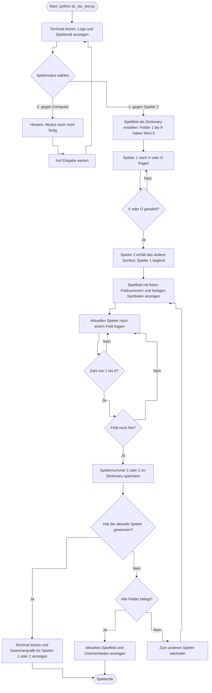

# Flussdiagramm: aktueller Spielablauf

Hinweis zum aktuellen Code: Bei einer ungültigen **Spielmoduswahl** wird das Menü zwar erneut aufgerufen, das Ergebnis dieses Aufrufs aber nicht zurückgegeben. Dadurch kann anschließend ein Fehler entstehen. Die Eingabeprüfung für die **Spielfelder** wiederholt die Frage dagegen korrekt.
