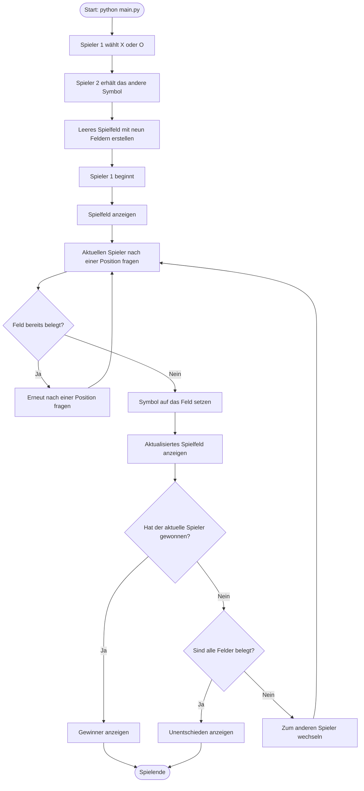

# Flussdiagramm: Tic-Tac-Toe

Die Prüfung auf ein bereits belegtes Feld ist eine optionale Erweiterung aus der Aufgabenstellung. Weitere Eingabefehler und zusätzliche Spielrunden sind hier nicht dargestellt.
